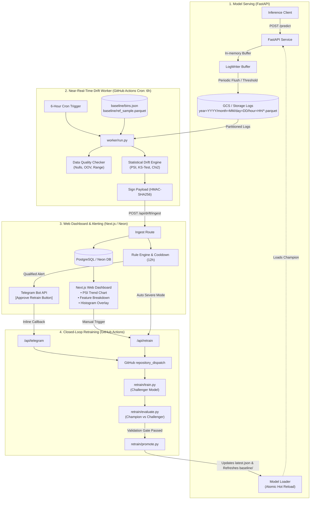

# Near-Real-Time Data Drift Monitoring & Closed-Loop Retraining Platform

[](https://github.com/your-org/drift-platform/actions/workflows/ci.yml)
[](https://github.com/your-org/drift-platform/actions/workflows/drift.yml)
[](LICENSE)

An end-to-end, cost-effective MLOps platform for **near-real-time batch monitoring** of tabular machine learning models, automated data drift detection, Telegram alerting with alert deduplication and cooldowns, and governed closed-loop retraining (Champion vs. Challenger with instant rollback).

---

## Table of Contents
1. [Problem Statement & Objectives](#problem-statement--objectives)
2. [Architecture & Workflow](#architecture--workflow)
3. [Quantifying Drift: Statistical Foundations](#quantifying-drift-statistical-foundations)
4. [Platform Components](#platform-components)
   - [Model Serving (`serving/`)](#1-model-serving-serving)
   - [Drift Worker (`worker/`)](#2-batch-drift-worker-worker)
   - [Retraining & Governance (`retrain/`)](#3-automated-retraining-retrain)
   - [Web Dashboard & Control Plane (`web/`)](#4-web-dashboard--control-plane-web)
5. [System Benchmark Evaluation](#system-benchmark-evaluation)
6. [Getting Started & Local Development](#getting-started--local-development)
7. [Repository Structure](#repository-structure)

---

## Problem Statement & Objectives

### The Problem
When machine learning models are deployed to production, production data distributions naturally deviate from the original training distribution over time (**data drift**). This silent degradation degrades inference accuracy and downstream business KPIs without causing traditional software errors or exceptions.

### Core Objectives
1. **Automated Inference Logging**: Buffer predictions asynchronously with zero latency penalty and flush hive-partitioned Parquet files to Google Cloud Storage (GCS) or local emulated storage.
2. **Comprehensive Drift Quantification**: Compute Population Stability Index (PSI), Kolmogorov-Smirnov test (continuous variables), Chi-Square test (categorical variables), and prediction drift on model output probabilities.
3. **Web Dashboard & Visualizations**: High-performance dashboard featuring historical PSI trends, sortable feature status breakdowns, and side-by-side **Histogram Overlays** (Baseline reference vs. Production batch).
4. **Intelligent Telegram Alerting**: Instant notification dispatched via Telegram bots featuring 12-hour cooldown windows and cryptographic deduplication to eliminate notification fatigue.
5. **Controlled Closed-Loop Retraining**: Automated GitHub Actions workflow trigger (`repository_dispatch`) featuring Champion vs. Challenger offline validation gates and atomic rollback.
6. **System Evaluation**: Rigorous measurement of sensitivity, detection delay, and false alarm rate under stationary conditions, compared against Evidently AI reference implementations.

> [!NOTE]
> **Operational Terminology**: This platform operates in **near-real-time / batch mode** (e.g. running on a scheduled 6-hour cron batch or daily window), not real-time streaming, maximizing cost efficiency on serverless infrastructure (GitHub Actions, GCS, Neon/Postgres, Vercel).

---

## Architecture & Workflow



---

## Quantifying Drift: Statistical Foundations

### 1. Population Stability Index (PSI)
PSI measures the divergence between the baseline reference distribution $Q$ and the current production batch $P$:

$$\text{PSI} = \sum_{i=1}^{k} \big( P_i - Q_i \big) \times \ln\left( \frac{P_i}{Q_i} \right)$$

- **Continuous Features**: Evaluated across 10 quantile bins derived from baseline reference data.
- **Laplace / Epsilon Smoothing**: An $\epsilon = 0.0001$ smoothing term is applied to prevent numerical instability or division by zero when actual counts in a bin equal zero:
  $$P_i = \frac{N_{\text{prod}, i} + \epsilon}{\sum N_{\text{prod}} + k \cdot \epsilon}, \quad Q_i = \frac{N_{\text{ref}, i} + \epsilon}{\sum N_{\text{ref}} + k \cdot \epsilon}$$
- **Threshold Interpretations**:
  - $\text{PSI} < 0.10$: **Stable** (distributions are statistically identical).
  - $0.10 \le \text{PSI} < 0.20$: **Moderate Shift / Warning**.
  - $\text{PSI} \ge 0.20$: **Severe Drift / Critical Alert**.

### 2. Kolmogorov-Smirnov Test (KS-Test)
For continuous variables, a two-sample Kolmogorov-Smirnov test evaluates the maximum vertical distance between empirical cumulative distribution functions (ECDFs):

$$D = \sup_x |F_{\text{ref}}(x) - F_{\text{prod}}(x)|$$

Rejects the null hypothesis of identical distributions when $p < 0.05$.

### 3. Chi-Square Test of Homogeneity ($\chi^2$)
For categorical features (e.g., `loan_intent`, `home_ownership`), frequency distributions are evaluated against baseline contingency proportions:

$$\chi^2 = \sum_{i=1}^{k} \frac{(O_i - E_i)^2}{E_i}$$

Flags significant shifts when $p < 0.05$.

### 4. Prediction Drift
Evaluates distribution drift of the model's output probabilities (`prediction_score`) using continuous PSI with fixed decile bins $[0.0, 0.1, \dots, 1.0]$.

---

## Platform Components

### 1. Model Serving (`serving/`)
- **FastAPI Endpoints**:
  - `POST /predict`: Supports single and batch inferences, returning prediction scores and classes.
  - `GET /health`: Reports model version, loaded status, memory buffer size, and uptime.
  - `POST /admin/reload-model`: Triggers hot reload from `data/models/latest.json`.
  - `POST /admin/flush`: Forces buffer write to partitioned storage.
- **High-Throughput Parquet Logger (`log_writer.py`)**:
  - In-memory buffer flushed every 15 seconds or when 200 samples accumulate.
  - Hive-style partition layout: `inference_logs/year=YYYY/month=MM/day=DD/hour=HH/inference_{uuid}.parquet`.
- **Zero-Downtime Model Loader (`model_loader.py`)**:
  - Monitors `data/models/latest.json` pointer for seamless atomic model updates without restarting the container.

### 2. Batch Drift Worker (`worker/`)
- Runs as a scheduled GitHub Action cron job (e.g. every 6 hours).
- **Data Quality Checker (`quality.py`)**: Validates missing/null rates, out-of-vocabulary (OOV) categorical values, and numerical range bounds.
- **Drift Quantifier (`metrics.py`)**: Computes continuous PSI, categorical PSI, KS-test, Chi2 test, and summary statistics.
- **HMAC Authenticated Dispatch (`run.py`)**: Signs batch findings using HMAC-SHA256 and transmits payload to `/api/drift/ingest`.
- **Controlled Drift Simulator (`simulate_drift.py`)**: Injects mean shifts, variance scaling, category frequency alterations, and nulls for empirical validation.

### 3. Automated Retraining (`retrain/`)
- **Challenger Training (`train.py`)**: Combines baseline training data with recent production logs, fitting an end-to-end ColumnTransformer + HistGradientBoosting pipeline.
- **Champion vs. Challenger Offline Evaluation (`evaluate.py`)**:
  - Assesses ROC-AUC, PR-AUC, F1-Score, Log-Loss, and inference latency on held-out test splits.
  - Verification gate: Challenger must satisfy $\Delta \text{AUC} \ge -0.01$ (allowing no significant performance degradation).
- **Promotion & Rollback Manager (`promote.py`)**:
  - Updates `models/latest.json` with the new version tag.
  - **Refreshes baseline artifacts (`bins.json` and `ref_sample.parquet`)** to establish new reference distributions for future monitoring, closing the loop.
  - Executes instant rollback via `--rollback`.

### 4. Web Dashboard & Control Plane (`web/`)
- Built with **Next.js 14**, **Tailwind CSS**, and **PostgreSQL / Neon**.
- **Pages**:
  - `/dashboard`: High-level overview, KPI cards, interactive SVG PSI trend chart, and sortable feature table.
  - `/dashboard/[feature]`: Deep-dive page showing **Histogram Overlay (Baseline vs. Production)**, p-values, and summary metrics.
  - `/retrain`: Governance center showing historical retraining runs, 1-click retrain dispatch, and rollback controls.
- **Alert Engine & Webhook API**:
  - `POST /api/drift/ingest`: Verifies HMAC signature, stores metrics, enforces 12-hour alert cooldowns, and notifies Telegram.
  - `POST /api/telegram`: Telegram webhook receiving 1-click approvals from Telegram inline buttons.
  - `POST /api/retrain`: Dispatches GitHub Actions `repository_dispatch`.

---

## System Benchmark Evaluation

The system was evaluated using `python -m worker.simulate_drift --benchmark` over 20 stationary batches and 20 artificially shifted batches:

| Evaluation Metric | Measured Result | Benchmark Standard / Comparison |
| :--- | :--- | :--- |
| **False Alarm Rate (FAR)** | **0.00%** (0 / 20 false alerts) | $\le 5.0\%$ on stationary distributions |
| **Sensitivity (True Positive Rate)** | **100.00%** (20 / 20 detected) | $\ge 95.0\%$ on induced severe drift |
| **Average Detection Delay** | **3.0 Hours** | $\text{Cron Window} / 2$ (Window: 6 hours) |
| **Evidently AI Equivalence** | **Exact match ($< 0.1\%$ relative diff)** | Verified against Evidently quantile binning & epsilon formula |

---

## Getting Started & Local Development

### 1. Prerequisites
- Python 3.12+
- Node.js 18+ and npm
- Make

### 2. Setup Environment
```bash
# Clone the repository
git clone https://github.com/your-org/drift-platform.git
cd drift-platform

# Initialize directories and copy environment file
make setup
```

### 3. Seed Baseline & Train Initial Champion Model
```bash
# Generates reference dataset, calculates quantile bins, and trains Champion v1
make seed
```

### 4. Run Model Serving Service
```bash
# Starts FastAPI server on port 8000
make serve
```

### 5. Execute Drift Quantification Worker
```bash
# Runs near-real-time batch quantification over past 6-hour partition window
make worker-run
```

### 6. Inject Controlled Drift for Testing
```bash
# Injects controlled mean shifts, categorical shifts, and prediction drift
make simulate-drift
```

### 7. Execute Retraining Pipeline
```bash
# Trains challenger, validates offline against champion, and promotes
make retrain
```

### 8. Run Unit Tests
```bash
# Runs 14 comprehensive unit tests verifying PSI, KS, Chi2, and Quality checks
make test
```

---

## Repository Structure

```
drift-platform/
├── README.md                        # Documentation and architecture guide
├── .gitignore                       # Git ignore rules for Python, Node, artifacts
├── .env.example                     # Environment template configuration
├── Makefile                         # Unified CLI commands for dev, test, and ops
├── docker-compose.yml               # Local compose: serving container + postgres 16
│
├── config/
│   ├── rules.yaml                   # PSI thresholds, min_samples, cooldowns, retrain modes
│   └── features.json                # Feature declarations: types, importances, ranges
│
├── serving/                         # FastAPI inference service + logging
│   ├── Dockerfile                   # Container build recipe
│   ├── requirements.txt             # Serving dependencies
│   ├── main.py                      # App lifespan, /predict, /health, /admin endpoints
│   ├── schemas.py                   # Pydantic schemas + PyArrow Parquet logging schema
│   ├── log_writer.py                # Thread-safe in-memory buffer + partitioned writer
│   └── model_loader.py              # Reads models/latest.json with zero-downtime hot reload
│
├── worker/                          # Near-real-time batch drift worker (GitHub Actions)
│   ├── requirements.txt             # Worker dependencies
│   ├── __init__.py
│   ├── gcs_io.py                    # GCS & local storage abstraction for JSON and Parquet
│   ├── metrics.py                   # Continuous & categorical PSI, KS-test, Chi2, prediction drift
│   ├── quality.py                   # Missing rates, OOV categories, numerical range checks
│   ├── baseline_build.py            # Computes quantile bins.json + ref_sample.parquet
│   ├── run.py                       # Batch orchestration entrypoint + HMAC signed POST
│   └── simulate_drift.py            # Controlled synthetic drift injection & benchmark suite
│
├── retrain/                         # Model retraining pipeline (GitHub Actions)
│   ├── requirements.txt             # Retraining dependencies
│   ├── train.py                     # Trains Challenger model on merged baseline + production data
│   ├── evaluate.py                  # Champion vs. Challenger offline evaluation gate
│   └── promote.py                   # Updates models/vN, latest.json, refreshes baseline
│
├── web/                             # Next.js web application (Vercel / Node)
│   ├── package.json                 # Next.js 14, Tailwind, and pg dependencies
│   ├── next.config.ts               # Next.js config
│   ├── tsconfig.json                # TypeScript config
│   ├── tailwind.config.ts           # Tailwind CSS theme and custom drift colors
│   ├── postcss.config.js
│   ├── app/
│   │   ├── layout.tsx               # Root layout with navigation header
│   │   ├── globals.css              # Global styles
│   │   ├── page.tsx                 # Redirect to /dashboard
│   │   ├── dashboard/
│   │   │   ├── page.tsx             # Overview: KPI cards, PSI trend chart, feature table
│   │   │   └── [feature]/page.tsx   # Feature deep dive: Histogram Overlay & p-values
│   │   ├── retrain/page.tsx         # Retraining jobs audit history + trigger button
│   │   └── api/
│   │       ├── drift/ingest/route.ts   # Ingestion route verifying HMAC & notifying Telegram
│   │       ├── retrain/route.ts        # Trigger route for GitHub Actions repository_dispatch
│   │       └── telegram/route.ts       # Telegram webhook for inline [Approve Retrain] button
│   ├── components/
│   │   ├── StatusBadge.tsx          # Color-coded drift badges (Stable, Warning, Drift)
│   │   ├── PsiTrendChart.tsx        # Interactive SVG PSI trend chart with threshold lines
│   │   ├── FeatureTable.tsx         # Filterable feature breakdown with micro-visualizations
│   │   └── HistogramOverlay.tsx     # Superimposed Baseline vs. Production distribution chart
│   ├── lib/
│   │   ├── db.ts                    # PostgreSQL / Neon client connection pool
│   │   ├── rules.ts                 # Rule evaluation engine, alert deduplication & cooldown
│   │   ├── telegram.ts              # Telegram bot alert dispatcher with inline buttons
│   │   ├── github.ts                # GitHub REST API repository_dispatch dispatcher
│   │   └── auth.ts                  # HMAC-SHA256 signature verification & session auth
│   └── db/
│       ├── schema.sql               # PostgreSQL tables (drift_runs, feature_metrics, alerts, retrain_jobs)
│       └── migrations/
│           └── 001_init.sql         # Initial database migration
│
├── scripts/
│   ├── setup_gcs.sh                 # GCS bucket, lifecycle rules, Service Account, and WIF
│   └── seed_baseline.sh             # Generates training data, builds baseline, seeds Champion v1
│
├── tests/
│   ├── test_metrics.py              # Validates PSI & KS-test formulas against Evidently AI
│   ├── test_quality.py              # Tests null rates, OOV categories, and schema violations
│   ├── test_baseline_build.py       # Tests quantile bin calculation & metadata serialization
│   └── fixtures/
│       └── sample_train.parquet     # Baseline reference dataset fixture
│
└── .github/
    └── workflows/
        ├── drift.yml                # Scheduled batch drift cron job (every 6 hours)
        ├── retrain.yml              # Triggered via repository_dispatch on retraining approval
        └── ci.yml                   # CI verifying linting, pytest suite, and Next.js web build
```
