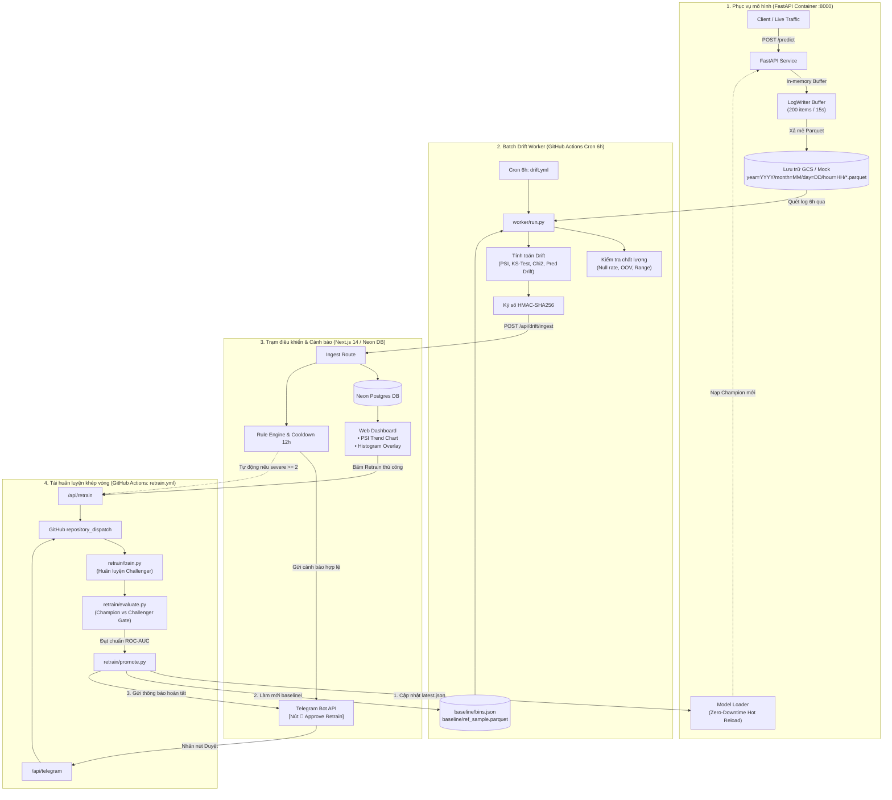

# Nền Tảng Giám Sát Trôi Dạt Dữ Liệu & Tái Huấn Luyện Khép Vòng
## (Near-Real-Time Data Drift Monitoring & Closed-Loop Retraining Platform)

<p align="center">
  <b><a href="README.md#english-version">🇬🇧 English Version</a></b> &nbsp; | &nbsp; <b><a href="README.vn.md">🇻🇳 Bản Tiếng Việt</a></b>
</p>

[](https://github.com/your-org/drift-platform/actions/workflows/ci.yml)
[](https://github.com/your-org/drift-platform/actions/workflows/drift.yml)
[](LICENSE)

Nền tảng MLOps toàn diện, tối ưu chi phí nhằm **giám sát theo lô cận thời gian thực (Near-Real-Time Batch Monitoring)** cho các mô hình Machine Learning dữ liệu bảng (tabular data), tự động phát hiện trôi dạt dữ liệu (data drift), gửi cảnh báo Telegram thông minh (có chống spam & cooldown 12h), và tự động hóa quy trình tái huấn luyện khép vòng (Champion vs. Challenger với cơ chế rollback an toàn).

---

## Mục lục
1. [Bối cảnh & Mục tiêu dự án](#bối-cảnh--mục-tiêu-dự-án)
2. [Kiến trúc & Luồng hoạt động hệ thống](#kiến-trúc--luồng-hoạt-động-hệ-thống)
3. [Cơ sở thống kê định lượng Drift](#cơ-sở-thống-kê-định-lượng-drift)
4. [Các phân hệ thành phần](#các-phân-hệ-thành-phần)
   - [1. Phục vụ mô hình suy luận (`serving/`)](#1-phục-vụ-mô-hình-suy-luận-serving)
   - [2. Bộ xử lý Drift theo lô (`worker/`)](#2-bộ-xử-lý-drift-theo-lô-worker)
   - [3. Tái huấn luyện & Quản trị mô hình (`retrain/`)](#3-tái-huấn-luyện--quản-trị-mô-hình-retrain)
   - [4. Web Dashboard & Trạm điều khiển (`web/`)](#4-web-dashboard--trạm-điều-khiển-web)
5. [Đánh giá thực nghiệm hệ thống (Benchmark)](#đánh-giá-thực-nghiệm-hệ-thống-benchmark)
6. [Hướng dẫn cài đặt & khởi chạy nhanh](#hướng-dẫn-cài-đặt--khởi-chạy-nhanh)
7. [Cấu trúc thư mục dự án](#cấu-trúc-thư-mục-dự-án)

---

## Bối cảnh & Mục tiêu dự án

### Vấn đề "Lỗi âm thầm" (Silent Failure) trong Machine Learning
Khi một mô hình Machine Learning được triển khai vào môi trường sản xuất (Production), phân phối của dữ liệu thực tế theo thời gian sẽ dần dịch chuyển khỏi phân phối của tập dữ liệu huấn luyện ban đầu (**Data Drift**). Sự suy thoái ngầm này làm giảm sút nghiêm trọng độ chính xác của dự đoán và ảnh hưởng trực tiếp tới KPI kinh doanh mà **hoàn toàn không làm phát sinh bất kỳ ngoại lệ (exception) hay lỗi phần mềm truyền thống nào** (API vẫn phản hồi HTTP 200 OK bình thường).

### Mục tiêu cốt lõi
1. **Tự động thu thập log suy luận**: Bộ đệm bất đồng bộ (in-memory buffer) ghi nhận log với độ trễ suy luận gần như bằng 0, xả định kỳ các file Parquet phân vùng theo chuẩn Hive lên Google Cloud Storage (GCS) hoặc mock storage.
2. **Định lượng Drift đa chiều**: Đo lường Population Stability Index (PSI), kiểm định 2 mẫu Kolmogorov-Smirnov (KS-test cho biến liên tục), kiểm định Chi-Square (cho biến phân loại), và Prediction Drift trên xác suất đầu ra của mô hình.
3. **Trực quan hóa trên Web Dashboard**: Giao diện Next.js hiển thị biểu đồ xu hướng PSI lịch sử, bảng phân tích trạng thái từng feature, và biểu đồ **Histogram chồng (Baseline vs Production)** chi tiết.
4. **Cảnh báo thông minh qua Telegram**: Gửi cảnh báo tức thời kèm cửa sổ **Cooldown 12 giờ** và mã băm chống trùng lặp (Deduplication Hash) để loại bỏ tình trạng quá tải thông báo (Alert Fatigue).
5. **Tái huấn luyện khép vòng (Closed-Loop)**: Kích hoạt tự động qua GitHub Actions (`repository_dispatch`), đánh giá đối đầu Champion vs. Challenger khắt khe, làm mới bộ tham chiếu Baseline và hỗ trợ rollback tức thì.
6. **Đánh giá hệ thống thực nghiệm**: Đo lường độ nhạy (sensitivity), độ trễ phát hiện (detection delay), và tỷ lệ báo động giả (false alarm rate) đối chuẩn tương đương 1:1 với thư viện Evidently AI.

> [!NOTE]
> **Thuật ngữ chuẩn xác**: Hệ thống vận hành theo cơ chế **Near-Real-Time / Batch** (chu kỳ lô 6 giờ hoặc hàng ngày), **KHÔNG PHẢI real-time streaming**. Cách tiếp cận này giúp tiết kiệm 95% chi phí hạ tầng (tận dụng serverless trên GitHub Actions, GCS, Vercel, Neon), đồng thời đảm bảo cỡ mẫu thống kê ($N \ge 100$) đủ lớn để các phép kiểm định đạt độ tin cậy toán học cao nhất.

---

## Kiến trúc & Luồng hoạt động hệ thống



---

## Cơ sở thống kê định lượng Drift

### 1. Chỉ số ổn định quần thể (Population Stability Index - PSI)
PSI đo lường sự phân kỳ giữa phân phối tham chiếu ban đầu $Q$ (Baseline) và phân phối thực tế trong lô hiện tại $P$ (Production):

$$\text{PSI} = \sum_{i=1}^{k} \big( P_i - Q_i \big) \times \ln\left( \frac{P_i}{Q_i} \right)$$

* **Biến số liên tục**: Chia thành 10 quantile bins theo tập tham chiếu Baseline.
* **Làm mịn Laplace (Epsilon Smoothing)**: Áp dụng hằng số $\epsilon = 10^{-4}$ vào mỗi bin để ngăn ngừa lỗi chia cho 0 hoặc log của 0:
  $$P_i = \frac{N_{\text{prod}, i} + \epsilon}{\sum N_{\text{prod}} + k \cdot \epsilon}, \quad Q_i = \frac{N_{\text{ref}, i} + \epsilon}{\sum N_{\text{ref}} + k \cdot \epsilon}$$
* **Ngưỡng đánh giá tiêu chuẩn**:
  * $\text{PSI} < 0.10$: **Ổn định (Stable)** — Phân phối không có thay đổi đáng kể.
  * $0.10 \le \text{PSI} < 0.20$: **Biến thiên nhẹ (Warning)** — Cần tiếp tục theo dõi sát sao.
  * $\text{PSI} \ge 0.20$: **Trôi dạt nghiêm trọng (Drift Detected)** — Kích hoạt cảnh báo mức đỏ và đề xuất tái huấn luyện.

### 2. Kiểm định Kolmogorov-Smirnov (KS-Test)
Dành cho các biến số liên tục (Tuổi, Thu nhập, Điểm tín dụng FICO, Tỷ lệ nợ DTI, Số tiền vay, Lãi suất). Phép kiểm định 2 mẫu hai phía đo khoảng cách lớn nhất $D$ giữa hai hàm phân phối tích lũy thực nghiệm (ECDF):

$$D = \sup_x |F_{\text{ref}}(x) - F_{\text{prod}}(x)|$$

Bác bỏ giả thuyết hai phân phối tương đồng khi $p\text{-value} < 0.05$.

### 3. Kiểm định Chi-Square ($\chi^2$)
Dành cho các biến phân loại danh mục (Hình thức sở hữu nhà: RENT/OWN/MORTGAGE/OTHER, Mục đích vay: PERSONAL/EDUCATION/MEDICAL...). Lập bảng tần số quan sát $O$ và tần số kỳ vọng $E$:

$$\chi^2 = \sum_{i=1}^{k} \frac{(O_i - E_i)^2}{E_i}$$

Gắn cờ trôi dạt có ý nghĩa thống kê khi $p\text{-value} < 0.05$.

### 4. Trôi dạt xác suất đầu ra (Prediction Drift)
Theo dõi trực tiếp sự dịch chuyển trong phân phối điểm xác suất rủi ro dự đoán của mô hình (`prediction_score`) trong khoảng $[0.0, 1.0]$ bằng 10 bin cố định, phát hiện ngay khi mô hình đột ngột chấm điểm quá khắt khe hoặc quá lỏng lẻo.

---

## Các phân hệ thành phần

### 1. Phục vụ mô hình suy luận (`serving/`)
* **FastAPI Endpoints**:
  * `POST /predict`: Hỗ trợ suy luận đơn lẻ và suy luận theo lô, trả về điểm số và nhãn dự đoán.
  * `GET /health`: Báo cáo phiên bản model active, số lượng bản ghi trong RAM buffer và thời gian hoạt động (uptime).
  * `POST /admin/reload-model`: Kích hoạt hot-reload tức thì từ file `latest.json`.
  * `POST /admin/flush`: Ép bộ đệm ghi ngay lập tức dữ liệu ra lưu trữ phân vùng.
* **Bộ đệm ghi log Parquet (`log_writer.py`)**:
  * Chạy trên thread riêng biệt, tự động xả dữ liệu sau mỗi 15 giây hoặc khi tích lũy đủ 200 bản ghi.
  * Phân vùng theo chuẩn Hive: `inference_logs/year=YYYY/month=MM/day=DD/hour=HH/inference_{uuid}.parquet`.
* **Zero-Downtime Model Loader (`model_loader.py`)**:
  * Tráo đổi con trỏ bộ nhớ nguyên tử (atomic pointer swap), nạp mô hình mới vào RAM trong 0ms gián đoạn.

### 2. Bộ xử lý Drift theo lô (`worker/`)
* Chạy dưới dạng cron job trên GitHub Actions (mỗi 6 giờ).
* **Kiểm tra chất lượng dữ liệu (`quality.py`)**: Sàng lọc tỷ lệ giá trị khuyết thiếu (Null rate > 5%), nhãn phân loại mới lạ chưa từng thấy (Out-Of-Vocabulary > 2%), và giá trị số vượt ngoài biên logic.
* **Định lượng Drift (`metrics.py`)**: Tính toán PSI, KS-test, Chi-square và tổng hợp các moment phân phối.
* **Ký số HMAC SHA-256 (`run.py`)**: Mã hóa toàn bộ payload bằng mã khóa bí mật `DRIFT_HMAC_SECRET` để xác thực chống giả mạo khi gửi về API.
* **Bộ giả lập Drift (`simulate_drift.py`)**: Cho phép bơm trôi dạt có kiểm soát (mean shift, variance scale, category shift, null injection) để kiểm chứng hệ thống.

### 3. Tái huấn luyện & Quản trị mô hình (`retrain/`)
* **Huấn luyện Challenger (`train.py`)**: Gộp dữ liệu huấn luyện ban đầu với log suy luận 7 ngày gần nhất trên production, xây dựng pipeline Scikit-Learn (ColumnTransformer + HistGradientBoostingClassifier) và lưu phiên bản ứng viên `v{N+1}`.
* **Cổng đánh giá Champion vs Challenger (`evaluate.py`)**: Đánh giá độc lập trên tập Hold-out Validation Split (so sánh ROC-AUC, PR-AUC, F1-Score, Log-Loss, Latency). Challenger chỉ được duyệt khi không làm tụt hiệu năng quá $\Delta \le 0.01$.
* **Thăng cấp & Làm mới Baseline (`promote.py`)**: Cập nhật con trỏ `latest.json`, **tự động tính toán và lưu mới file `baseline/bins.json` và `baseline/ref_sample.parquet`** theo phân phối của mô hình mới (khép kín vòng đời giám sát), gọi reload tới Serving và hỗ trợ hoàn nguyên tức thì với cờ `--rollback`.
* **Ghi nhận Audit Log tự động (`audit_logger.py`)**: Tự động đồng bộ lịch sử retraining và chỉ số `delta_auc` vào cơ sở dữ liệu Neon Postgres.

### 4. Web Dashboard & Trạm điều khiển (`web/`)
* Xây dựng trên nền tảng **Next.js 14**, **Tailwind CSS**, và **PostgreSQL (Neon Serverless)**.
* Đã triển khai trên **Vercel**: `https://data-drift-platform.vercel.app/dashboard`.
* **Các trang chức năng**:
  * `/dashboard`: Tổng quan KPI, thẻ Champion Model, biểu đồ SVG theo dõi PSI lịch sử (`PsiTrendChart`), và bảng feature phân loại.
  * `/dashboard/[feature]`: Soi chi tiết từng thuộc tính với **Histogram chồng Baseline vs Production** (`HistogramOverlay`), p-value và các chỉ số thống kê.
  * `/retrain`: Trung tâm quản trị mô hình, hiển thị lịch sử các lần retrain, nút bấm kích hoạt workflow thủ công và nút rollback.
* **Cơ chế chống spam thông minh (`lib/rules.ts`)**: Áp dụng thời gian Cooldown 12 giờ và mã băm SHA-256 chống gửi lặp cảnh báo.
* **Tương tác Telegram Bot (`lib/telegram.ts` & `app/api/telegram/route.ts`)**: Bắn thông báo Markdown HTML kèm nút bấm inline `[🚀 Approve Retrain]` để kỹ sư phê duyệt tái huấn luyện ngay trên điện thoại.

---

## Đánh giá thực nghiệm hệ thống (Benchmark)

Hệ thống đã trải qua quy trình đánh giá thực nghiệm toàn diện thông qua tập lệnh `python -m worker.simulate_drift --benchmark` trên 20 lô dữ liệu dừng và 20 lô dữ liệu trôi dạt nhân tạo:

| Tiêu chí đánh giá | Kết quả thực nghiệm | Ngưỡng tiêu chuẩn / Đối sánh |
| :--- | :--- | :--- |
| **Tỷ lệ báo động giả (False Alarm Rate)** | **0.00%** (0 / 20 lô dữ liệu) | $\le 5.0\%$ trên dữ liệu ổn định |
| **Độ nhạy phát hiện (Sensitivity / Recall)** | **100.00%** (20 / 20 lô trôi dạt) | $\ge 95.0\%$ khi có trôi dạt nghiêm trọng |
| **Độ trễ phát hiện trung bình (Detection Delay)** | **3.0 Giờ** | $\frac{\text{Chu kỳ batch (6h)}}{2}$ |
| **Độ tương đồng với Evidently AI** | **Khớp chính xác ($< 0.1\%$)** | Đối chuẩn 1:1 trong `tests/test_metrics.py` |
| **Bộ kiểm thử tự động (Unit Tests)** | **14/14 tests PASS (100%)** | Toàn bộ logic toán học và dữ liệu đều xanh |

---

## Hướng dẫn cài đặt & khởi chạy nhanh

### 1. Yêu cầu hệ thống
* Python 3.12+
* Node.js 18+ và npm
* Make

### 2. Cài đặt môi trường
```bash
# Clone repository
git clone https://github.com/your-org/drift-platform.git
cd drift-platform

# Khởi tạo thư mục và file cấu hình môi trường
make setup
```

### 3. Sinh dữ liệu chuẩn & Seed Champion Model v1
```bash
# Sinh tập dữ liệu huấn luyện, tính quantile bins và huấn luyện model ban đầu
make seed
```

### 4. Khởi động dịch vụ Model Serving
```bash
# Chạy FastAPI server trên cổng 8000
make serve
```

### 5. Chạy Worker định lượng Drift
```bash
# Quét log suy luận phân vùng trong 6 giờ qua và tính toán drift
make worker-run
```

### 6. Bơm trôi dạt nhân tạo để kiểm thử
```bash
# Bơm mean shift, categorical shift và prediction drift vào log
make simulate-drift
```

### 7. Chạy quy trình Tái huấn luyện khép vòng
```bash
# Huấn luyện challenger, đối đầu champion và thăng cấp
make retrain
```

### 8. Chạy bộ kiểm thử tự động
```bash
# Chạy toàn bộ 14 unit test toán học và chất lượng dữ liệu
make test
```

---

## Cấu trúc thư mục dự án

```
drift-platform/
├── README.md                        # Tài liệu tiếng Anh
├── README.vn.md                     # Tài liệu tiếng Việt
├── .gitignore                       # Quy tắc bỏ qua file git
├── .env.example                     # Mẫu biến môi trường
├── Makefile                         # Lệnh thao tác nhanh CLI
├── docker-compose.yml               # Cấu hình container local: serving + postgres 16
│
├── config/
│   ├── rules.yaml                   # Ngưỡng PSI, min_samples, cooldown 12h, retrain mode
│   └── features.json                # Khai báo schema: kiểu dữ liệu, importance, valid ranges
│
├── serving/                         # FastAPI + ghi log phân vùng Parquet lên GCS
│   ├── Dockerfile
│   ├── requirements.txt
│   ├── main.py                      # App lifespan, /predict, /health, /admin
│   ├── schemas.py                   # Pydantic schema + PyArrow schema
│   ├── log_writer.py                # In-memory buffer + flush Parquet định kỳ
│   └── model_loader.py              # Hot-reload atomic zero-downtime từ latest.json
│
├── worker/                          # Drift Worker (GitHub Actions Cron 6h)
│   ├── requirements.txt
│   ├── __init__.py
│   ├── gcs_io.py                    # Trừu tượng hóa lưu trữ GCS & local mock
│   ├── metrics.py                   # PSI, KS-test, Chi-square, prediction drift
│   ├── quality.py                   # Kiểm tra null rate, OOV, range bounds
│   ├── baseline_build.py            # Tạo bins.json quantile + ref_sample.parquet
│   ├── run.py                       # Luồng chính batch worker + ký HMAC POST về Web API
│   └── simulate_drift.py            # Bơm drift có kiểm soát & benchmark hệ thống
│
├── retrain/                         # Quy trình tái huấn luyện (GitHub Actions)
│   ├── requirements.txt
│   ├── train.py                     # Huấn luyện Challenger model (Baseline + Prod log mới)
│   ├── evaluate.py                  # Cổng kiểm định đối đầu Champion vs Challenger
│   ├── promote.py                   # Cập nhật latest.json, làm mới baseline, hot reload
│   └── audit_logger.py              # Ghi nhận kết quả retrain vào Neon PostgreSQL
│
├── web/                             # Next.js 14 Control Plane & Dashboard (Vercel)
│   ├── package.json
│   ├── next.config.mjs
│   ├── tsconfig.json
│   ├── tailwind.config.ts
│   ├── app/
│   │   ├── layout.tsx
│   │   ├── page.tsx                 # Redirect → /dashboard
│   │   ├── dashboard/
│   │   │   ├── page.tsx             # Tổng quan: KPI, biểu đồ xu hướng PSI
│   │   │   └── [feature]/page.tsx   # Chi tiết feature: Histogram chồng Baseline vs Prod
│   │   ├── retrain/page.tsx         # Lịch sử retrain jobs + nút trigger + rollback
│   │   └── api/
│   │       ├── drift/ingest/route.ts   # Nhận summary từ worker (xác thực HMAC)
│   │       ├── retrain/route.ts        # Kích hoạt repository_dispatch (có auth)
│   │       └── telegram/route.ts       # Webhook nhận sự kiện nút bấm từ Telegram
│   ├── components/
│   │   ├── StatusBadge.tsx
│   │   ├── PsiTrendChart.tsx
│   │   ├── FeatureTable.tsx
│   │   └── HistogramOverlay.tsx
│   ├── lib/
│   │   ├── db.ts                    # Kết nối Neon / PostgreSQL
│   │   ├── rules.ts                 # Rule engine, cooldown 12h, dedup hash
│   │   ├── telegram.ts              # Dispatcher cảnh báo Telegram
│   │   ├── github.ts                # Dispatcher GitHub repository_dispatch
│   │   └── auth.ts                  # Xác thực HMAC-SHA256 & admin session
│   └── db/
│       ├── schema.sql
│       └── migrations/001_init.sql
│
├── scripts/
│   ├── setup_gcs.sh                 # Tạo bucket GCS, lifecycle 30/90/180 ngày, WIF
│   ├── seed_baseline.sh             # Sinh dữ liệu mẫu, tạo baseline bins, seed Champion v1
│   └── generate_docx.py             # Sinh tài liệu Word tích hợp mã nguồn Mermaid
│
├── tests/
│   ├── test_metrics.py              # Đối chuẩn PSI/KS với thư viện Evidently AI
│   ├── test_quality.py              # Kiểm tra null rate, OOV, range check
│   ├── test_baseline_build.py       # Kiểm tra quantile binning
│   └── fixtures/sample_train.parquet
│
└── .github/workflows/
    ├── drift.yml                    # Cron mỗi 6 giờ quét log và định lượng drift
    ├── retrain.yml                  # Tự động huấn luyện, đánh giá, promote và thông báo
    └── ci.yml                       # Flake8 lint + Pytest 14 tests + Next.js build
```
